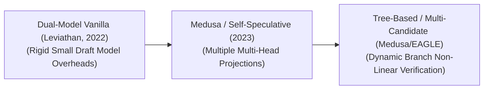

# Awesome-Speculative-Decoding
## Speculative Decoding: Evolution, Variants, Types, & Applications

Speculative Decoding—also known as assisted generation or draft-then-verify decoding—is an advanced inference optimization framework designed to accelerate token generation in Large Language Models (LLMs). Autoregressive generation is fundamentally bottlenecked by GPU memory bandwidth because a massive "target" model must load billions of weights from high-bandwidth memory (HBM) to on-chip SRAM just to predict a single token. Speculative Decoding breaks this bottleneck by using a compact, hyper-fast "draft" model to speculatively generate a sequence of candidate tokens (a draft look-ahead) in rapid succession. The massive target model then evaluates the entire block of candidate tokens simultaneously in a single, parallelized forward pass, drastically increasing generation throughput without altering the model's original mathematical output distribution.

---

## 1. The Chronological Evolution

The technical implementation of predictive generation has transitioned from simple dual-model pairs to self-contained single-model layers and tree-structured multi-hypothesis search paths.

| Era / Milestone | Key Concept & Details | Year | Paper / System Link |
| :--- | :--- | :--- | :--- |
| [**The Dual-Model Foundation Era**](docs/dual_model_foundation.md) (Leviathan et al. / Chen et al.) | **Concept:** The core milestone. Introduced the concept of pairing a massive target model (e.g., Llama-70B) with a distinct, tiny draft model from the same vocabulary family (e.g., Llama-7B). The draft model speculatively outputs $K$ tokens, which are verified concurrently by the target model using modified nucleus sampling boundaries.  **Limitation:** Maintaining, synchronizing, and hosting two separate model weights in VRAM introduces architectural system complexity and data alignment overheads. | 2022 | [Leviathan et al. (2022)](https://arxiv.org/abs/2211.17192) / [Chen et al. (2023)](https://arxiv.org/abs/2302.01318) |
| [**The Self-Speculative & Block-Head Era**](docs/self_speculative_block_head.md) (Medusa / Multi-Head) | **Concept:** Eliminated the secondary draft model entirely. Frameworks like **Medusa** appended multiple parallel, independent linear heads to the terminal layer of the *same* target model. Head 1 predicts token $n+1$, Head 2 predicts token $n+2$, and so on, enabling single-model speculative drafting.  **Significance:** Simplified deployment orchestration and avoided cross-model distribution shifts, unlocking a flat $2\times$ inference speedup out-of-the-box. | 2023 | [Medusa (2024)](https://arxiv.org/abs/2401.10774) |
| [**The Tree-Structured & Feature-Drafting Era**](docs/tree_structured_feature_drafting.md) | **Concept:** The modern state-of-the-art frontier standard. Systems like **EAGLE** and tree-based verification (e.g., SpecTr) abandoned linear text chains. Instead, the drafting mechanism produces a branching **Tree of Thoughts** or drafts hidden *feature vectors* rather than text tokens. The target model evaluates multiple speculative structural paths concurrently using customized sparse attention tree masks. | 2024 | [EAGLE (2024)](https://arxiv.org/abs/2401.15077) / [SpecTr (2023)](https://arxiv.org/abs/2310.15141) |

---

## 2. Core Architectural & System Variants

Speculative frameworks are strictly categorized based on the structural layout and parameter source of the drafting engine.

| Variant | Mechanism & Examples | Year | Paper / System Link |
| :--- | :--- | :--- | :--- |
| [**Independent Dual-Model Speculation**](docs/independent_dual_model.md) | **Mechanism:** Uses two entirely distinct networks sharing an identical tokenization vocabulary matrix. The draft model runs $K$ sequential greedy iterations before transferring the token list to the target architecture.  **Examples:** Standard PyTorch / Hugging Face Assisted Generation. | 2022 | [Leviathan et al. (2022)](https://arxiv.org/abs/2211.17192) / [Chen et al. (2023)](https://arxiv.org/abs/2302.01318) |
| [**Self-Speculative Decoding (Layer Skip / Draft Heads)**](docs/self_speculative_decoding.md) | **Mechanism:** Keeps a single model graph in memory. The drafting phase is executed either by skipping intermediate layers (e.g., passing text through only the first 5 layers of a 32-layer model) or by reading parallel token prediction heads appended to the top block.  **Examples:** Medusa, LayerSkip. | 2023 | [Draft & Verify (SSD) (2023)](https://arxiv.org/abs/2309.08168) / [LayerSkip (2024)](https://arxiv.org/abs/2404.16710) |
| [**Lookahead / Retrieval-Augmented Speculation**](docs/lookahead_retrieval_augmented.md) | **Mechanism:** Bypasses neural network drafting completely. It scrapes candidate tokens from a local cache of historical outputs, repeated phrases within the existing prompt context, or an external fast vector datastore.  **Examples:** Prompt Lookup Decoding, Rest-MCTS. | 2023 | [Prompt Lookup Decoding (2023)](https://github.com/apoorvumang/prompt-lookup-decoding) / [REST (2023)](https://arxiv.org/abs/2311.08252) |

---

## 3. Verification & Sampling Modality Types

When the target model reviews the candidate tokens, the validation engine utilizes distinct statistical verification layers to protect final generation accuracy.

| Modality Type | Mechanism | Year | Paper / System Link |
| :--- | :--- | :--- | :--- |
| [**Exact Greedy Verification**](docs/exact_greedy_verification.md) | A rigid boolean check used during deterministic execution ($T=0$). The target model compares its highest-probability tokens with the draft tokens. Generation stops immediately at the first token index where a mismatch occurs. | 2022 | [Leviathan et al. (2022)](https://arxiv.org/abs/2211.17192) / [Chen et al. (2023)](https://arxiv.org/abs/2302.01318) |
| [**Stochastic Acceptance (Modified Nucleus Sampling)**](docs/stochastic_acceptance.md) | Applied during creative generation blocks ($T > 0$). It implements a statistical validation rule that adjusts the target model's probability metrics on-the-fly, ensuring that the final text distribution perfectly matches the target model's native profile even if the draft model hallucinates. | 2022 | [Leviathan et al. (2022)](https://arxiv.org/abs/2211.17192) / [Chen et al. (2023)](https://arxiv.org/abs/2302.01318) |
| [**Tree-Masked Parallel Verification**](docs/tree_masked_parallel_verification.md) | Instead of verifying a single linear text string, the target model uses a specialized **block-diagonal attention tree mask** to verify dozens of branching alternative draft paths simultaneously within a single forward pass matrix multiplication. | 2023 | [SpecInfer (2023)](https://arxiv.org/abs/2305.09781) / [Medusa (2024)](https://arxiv.org/abs/2401.10774) |

---

## 4. Production Engineering Challenges & Mitigations

Deploying speculative serving layers within high-volume production setups requires balancing draft acceptance rates against hardware tensor core scaling.

| Challenge | Problem Description & Mitigation | Year | Paper / System Link |
| :--- | :--- | :--- | :--- |
| [**The Draft Acceptance Decay Bottleneck**](docs/draft_acceptance_decay.md) | **Problem:** The efficiency of speculative decoding depends heavily on the draft model's **Acceptance Rate ($\alpha$)**. If a model transitions from writing predictable chat dialog to analyzing complex legal codes, the draft model's predictions will fail frequently ($\alpha \rightarrow 0$), causing the system to reject the draft chunks and drop back to standard slow generation speeds.  **Mitigation:** Implementing **Dynamic Look-Ahead Scaling ($K$)**. The system tracks the acceptance rate in real-time; if the draft model is failing, it automatically shrinks the speculative window to $K=1$, scaling it back up to $K=5$ when semantic predictability recovers. | 2023 | [Online Speculative Decoding (2023)](https://arxiv.org/abs/2310.07177) / [SpecDec++ (2023)](https://arxiv.org/abs/2310.08461) |
| [**The Hardware Compute Saturation Threshold**](docs/hardware_compute_saturation.md) | **Problem:** Evaluating a block of candidate tokens scales up the number of floating-point operations (FLOPs) per forward pass. On highly busy enterprise servers operating at maximum batch sizes, the GPU is already compute-bound; adding speculative verification can stall the server instead of accelerating it.  **Mitigation:** Restricting Speculative Decoding deployment strictly to workloads with small batch sizes, low concurrency, or long context-window applications where the memory-bandwidth bottleneck dominates. | 2022 | [Leviathan et al. (2022)](https://arxiv.org/abs/2211.17192) / [Chen et al. (2023)](https://arxiv.org/abs/2302.01318) |

---

## 5. Frontier Real-World AI Applications

| Real-World Application | Description & Implementation Details | Year | Paper / System Link |
| :--- | :--- | :--- | :--- |
| [**High-Throughput Commercial Chat Serving (vLLM / TensorRT-LLM)**](docs/commercial_chat_serving.md) | Integrated directly into enterprise model-serving infrastructures. By pairing models like Llama 3 70B with highly optimized speculative kernels, providers drastically compress **Time-to-First-Token (TTFT)** and inter-token generation latency for real-time user-facing apps. | 2023 | [vLLM (2023)](https://arxiv.org/abs/2309.06180) / [TensorRT-LLM](https://github.com/NVIDIA/TensorRT-LLM) |
| [**Real-Time Autonomous Software Coding Assistants**](docs/software_coding_assistants.md) | Powers IDE autocomplete extensions. Because source code contains highly repetitive structural syntaxes, keywords (`def`, `return`, `import`), and common indentation spacing patterns, lookahead and self-speculative decoding engines achieve immense acceptance rates, outputting full blocks of code instantaneously. | 2023 | [Prompt Lookup Decoding (2023)](https://github.com/apoorvumang/prompt-lookup-decoding) / [SSD (2023)](https://arxiv.org/abs/2309.08168) |
| [**On-Device Edge Architecture Execution**](docs/on_device_edge_execution.md) | Running localized reasoning models on consumer hardware (smartphones, laptops). Because edge chips feature constrained memory bandwidth, speculative configurations minimize HBM lookup operations, permitting interactive, low-latency AI conversations without draining the device's physical battery cells. | 2024 | [EdgeLLM (2024)](https://ieeexplore.ieee.org/document/10596357) / [SpecMemo (2025)](https://arxiv.org/abs/2506.01986) |

