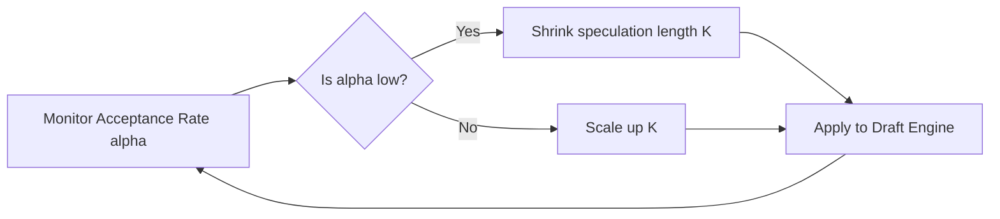

# The Draft Acceptance Decay Bottleneck

The Draft Acceptance Decay Bottleneck is a major production challenge where the speedup of speculative decoding degrades significantly due to changing user inputs.

## 💡 Core Concept
Speculative decoding's speedup is proportional to the draft model's acceptance rate $\alpha$. If the user prompt shifts from a domain where the draft model is highly accurate (e.g., standard conversational text) to a domain where it is inaccurate (e.g., complex code, math, or legal documents), $\alpha$ drops near zero.

## ⚙️ Mitigation: Dynamic Look-Ahead Scaling ($K$)
Instead of using a static speculation length $K$, the system monitors the acceptance rate in real-time.
*   If the acceptance rate is low, it dynamically shrinks $K$ to prevent wasting compute on rejected tokens.
*   If the acceptance rate recovers, it dynamically increases $K$.

## 📊 Feedback Loop Diagram

## 🔗 References
* [Online Speculative Decoding](https://arxiv.org/abs/2310.07177)
* [SpecDec++: Formulating Speculation Length K as a Markov Decision Process](https://arxiv.org/abs/2310.08461)
