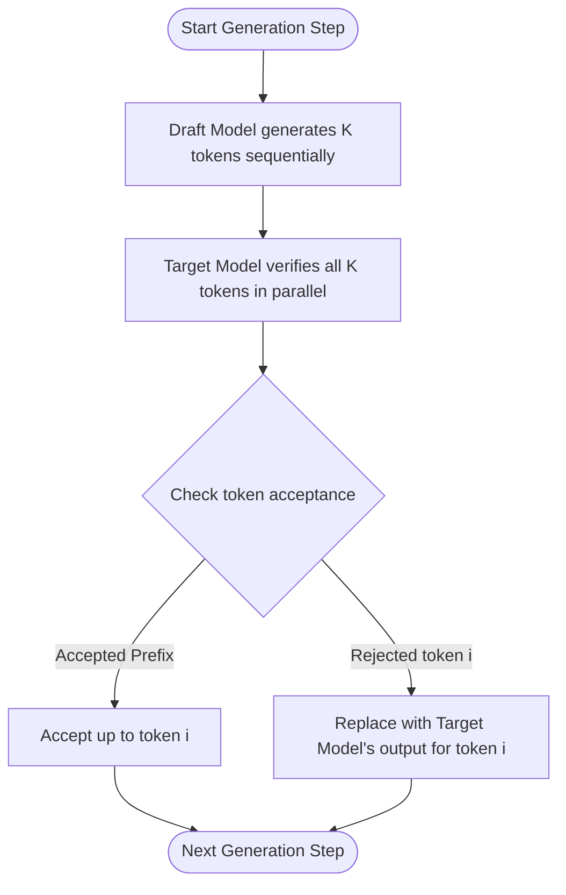

# The Dual-Model Foundation Era (Leviathan et al. / Chen et al., 2022)

The Dual-Model Foundation Era represents the birth of modern Speculative Decoding. It was introduced to address the memory bandwidth bottleneck of large autoregressive Transformers during token generation.

## 💡 Core Concept
Autoregressive decoding requires loading the entire target model parameters from High Bandwidth Memory (HBM) to on-chip SRAM just to predict a single token. Speculative decoding breaks this bottleneck by pairing a massive target model (e.g., Llama-70B) with a distinct, tiny draft model from the same vocabulary family (e.g., Llama-7B).

## ⚙️ How It Works
1. **Drafting:** The small draft model sequentially predicts a sequence of $K$ candidate tokens.
2. **Verification:** The large target model evaluates all $K$ candidate tokens concurrently in a single parallel forward pass.
3. **Acceptance:** Based on a modified statistical verification (greedy or stochastic), a prefix of the draft tokens is accepted. If a token is rejected, the target model's corrected prediction is used, and the process repeats.

## 📊 Process Flow Diagram

## ⚠️ Limitations
* Maintaining, synchronizing, and hosting two separate model weights in VRAM introduces architectural system complexity.
* Distribution shift between the draft and target models can cause low token acceptance rates.

## 🔗 References
* [Leviathan et al. (2022) - Fast Inference from Transformers via Speculative Decoding](https://arxiv.org/abs/2211.17192)
* [Chen et al. (2023) - Accelerating Large Language Model Decoding with Speculative Decoding](https://arxiv.org/abs/2302.01318)
