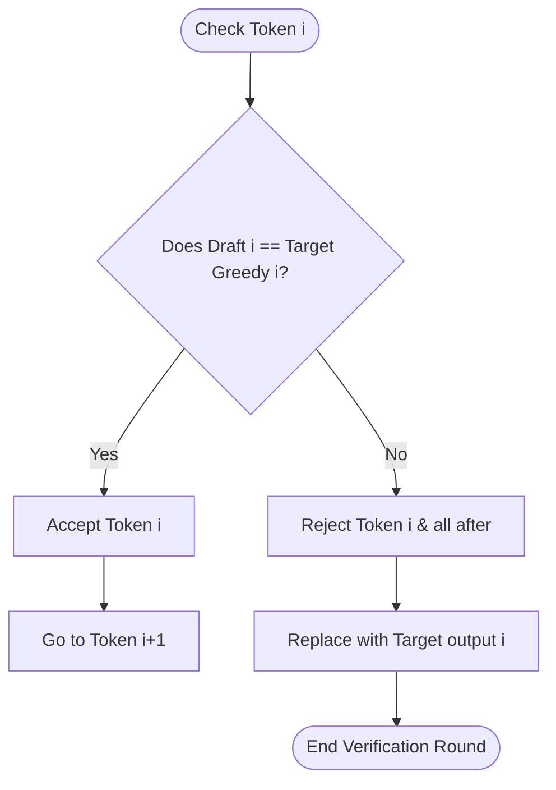

# Exact Greedy Verification

Exact Greedy Verification is the verification strategy used when the target model's temperature is set to zero ($T=0$), implying deterministic token generation.

## 💡 Core Concept
Under greedy decoding, there is only one correct token at each generation step (the token with the highest logit). The verifier simply performs an exact match check between the draft tokens and the target model's greedy outputs.

## ⚙️ Verification Mechanism
At step $i$ in the draft:
$$\text{If } D_i == \text{argmax}(P_{\text{target}}(t_i | t_{<i})) \rightarrow \text{Accept } D_i$$
If there is a mismatch, the verification terminates immediately, accepting the tokens up to $D_{i-1}$, appending the target model's corrected prediction for step $i$, and discarding the rest.

## 📊 Flowchart

## 🔗 References
* [Leviathan et al. (2022) - Fast Inference from Transformers via Speculative Decoding](https://arxiv.org/abs/2211.17192)
