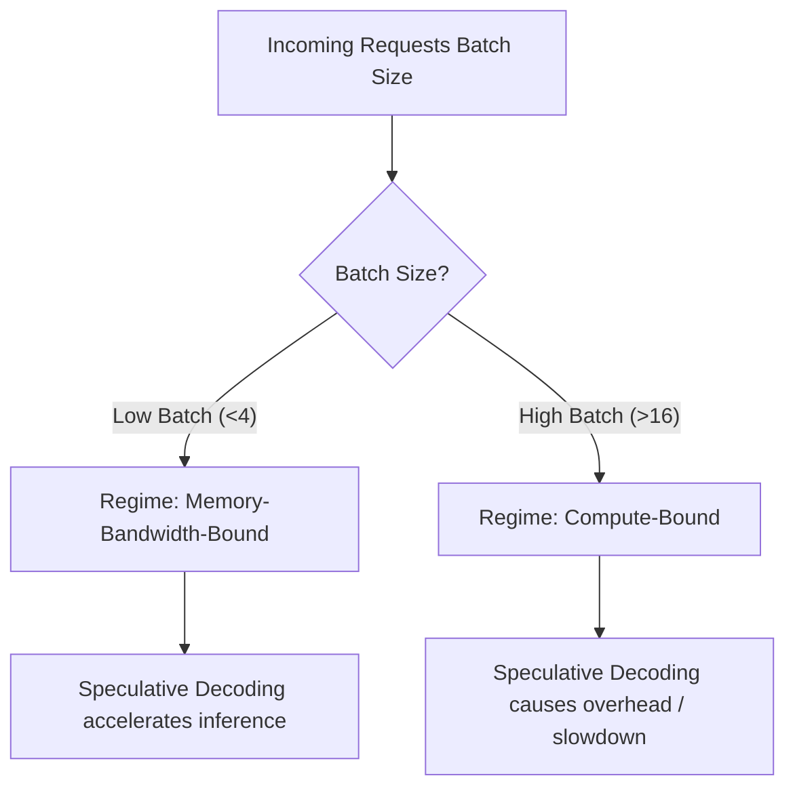

# The Hardware Compute Saturation Threshold

Speculative decoding is not always beneficial. Its performance is heavily dependent on whether the serving infrastructure is memory-bandwidth-bound or compute-bound.

## 💡 Memory-Bound vs. Compute-Bound Regimes
*   **Memory-Bound (Low Batch Sizes):** At low concurrency (batch sizes 1-4), the GPU spend most of its time loading model weights from VRAM. Tensor cores are under-utilized. Speculative decoding uses this idle compute to verify draft tokens, yielding a net latency benefit.
*   **Compute-Bound (High Batch Sizes / High Concurrency):** At high batch sizes, the GPU compute cores are fully saturated. Evaluating multiple draft tokens adds extra FLOPs that compete for compute resources, which can degrade overall throughput.

## 📊 Performance Trade-off Chart

## 🔗 References
* [Leviathan et al. (2022) - Fast Inference from Transformers via Speculative Decoding](https://arxiv.org/abs/2211.17192)
