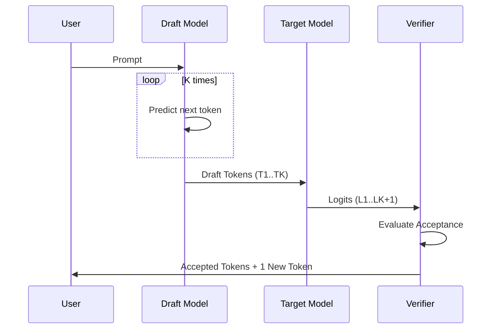

# Independent Dual-Model Speculation

Independent Dual-Model Speculation is the classic configuration where two completely separate neural networks are used as the drafter and the verifier.

## 💡 Core Concept
A small model (draft model) and a large model (target model) are deployed together. They must share an identical tokenizer and vocabulary so that tokens generated by the draft model can be evaluated directly by the target model.

## ⚙️ Detailed Flow
1. The draft model runs $K$ sequential autoregressive steps to produce $K$ draft tokens.
2. The draft tokens and the prompt are packed into a single batch and sent to the target model.
3. The target model performs a single forward pass to compute logits for all positions.
4. The verifier checks each token sequentially using greedy or stochastic acceptance rules.

## 📊 Sequence Diagram

## 🔗 References
* [Leviathan et al. (2022) - Fast Inference from Transformers via Speculative Decoding](https://arxiv.org/abs/2211.17192)
