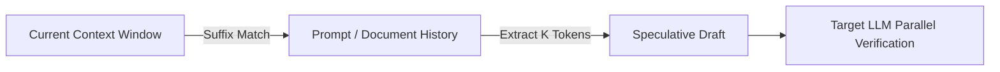

# Lookahead / Retrieval-Augmented Speculation

Lookahead and Retrieval-Augmented Speculation represents a category of speculative decoding that completely bypasses neural-network drafting, eliminating drafting computational overhead.

## 💡 Core Concept
Instead of running a small neural network to predict tokens, candidates are retrieved from a non-neural source, such as:
*   **Prompt Lookup:** Finding repeating patterns within the current context or history.
*   **RAG/Datastore:** Retrieving token subsequences from an external fast database or ngram cache.

## ⚙️ How It Works
*   The system matches the current context suffix against past generated text.
*   If a match is found, the following $K$ tokens are extracted as the speculative draft.
*   The target model verifies the retrieved draft in parallel.

## 📊 Process Diagram

## 🔗 References
* [Prompt Lookup Decoding (2023)](https://github.com/apoorvumang/prompt-lookup-decoding)
* [REST: Retrieval-Based Speculative Decoding](https://arxiv.org/abs/2311.08252)
