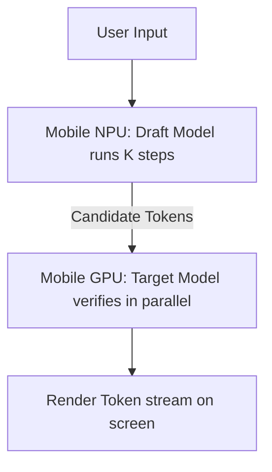

# On-Device Edge Architecture Execution

Running large language models on edge devices (smartphones, laptops) is heavily constrained by memory bandwidth and battery power. Speculative decoding acts as a crucial optimizer.

## 💡 Edge Device Bottlenecks
Edge chips (such as mobile NPUs or unified memory architectures) have much lower memory bandwidth compared to server-grade GPUs. Speculative configurations minimize High Bandwidth Memory (HBM) lookup operations, permitting interactive, low-latency AI conversations without draining the device's battery.

## ⚙️ Optimization Strategies
*   **NPU-GPU Pipelining:** Running the lightweight draft model on a low-power mobile NPU, while utilizing the GPU for target model verification.
*   **Memory Footprint Balancing:** Using lightweight techniques like n-gram draft caches to avoid loading a second model into the device's limited RAM.

## 📊 On-Device Architecture

## 🔗 References
* [EdgeLLM: Fast On-Device LLM Inference With Speculative Decoding](https://ieeexplore.ieee.org/document/10596357)
* [SpecMemo: Speculative Decoding is in Your Pocket](https://arxiv.org/abs/2506.01986)
