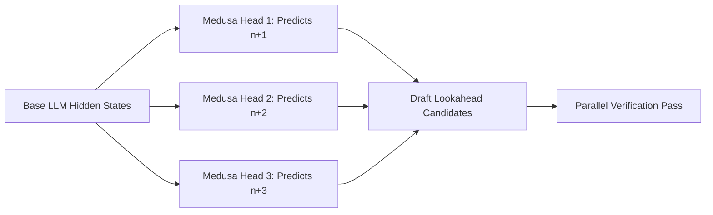

# The Self-Speculative & Block-Head Era (Medusa / Multi-Head)

To eliminate the operational complexity of hosting two separate models in VRAM, the Self-Speculative and Block-Head era introduced single-model speculation mechanisms.

## 💡 Core Concept
Instead of using an independent secondary model, frameworks like **Medusa** append multiple parallel, independent linear heads to the terminal hidden layer of the *same* target model.

## ⚙️ How It Works
* The base model processes the input sequence and produces hidden states.
* Multiple projection heads (Medusa Heads) generate candidate predictions for future token indices in parallel (Head 1 predicts $n+1$, Head 2 predicts $n+2$, etc.).
* Candidates are then validated concurrently in the next step.

## 📊 Architectural Diagram

## 🌟 Significance
* **Operational Simplicity:** Only one set of model weights is maintained in memory.
* **No Distribution Shift:** Draft candidates are predicted from the target model's own representations, yielding higher compatibility.

## 🔗 References
* [Medusa: Simple LLM Inference Acceleration Framework with Multiple Decoding Heads](https://arxiv.org/abs/2401.10774)
