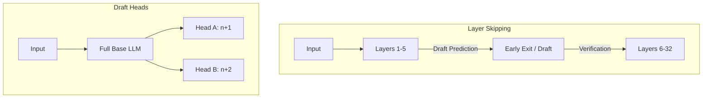

# Self-Speculative Decoding (Layer Skip / Draft Heads)

Self-Speculative Decoding consolidates the drafting and target architectures into a single neural network model, optimizing VRAM and deployment complexity.

## 💡 Core Concept
Instead of maintaining a separate draft model, the main LLM itself performs drafting. This is done by either:
1. **Layer Skipping:** Routing draft tokens through only a subset of the model's layers (e.g., first 5 out of 32 layers) to get quick predictions.
2. **Draft Heads:** Predicting future tokens using auxiliary linear heads attached to intermediate or final layers.

## 📊 Layer Skip vs. Draft Heads

## 🔗 References
* [Draft & Verify: Lossless Large Language Model Acceleration via Self-Speculative Decoding](https://arxiv.org/abs/2309.08168)
* [LayerSkip: Enabling Early Exit Inference and Self-Speculative Decoding](https://arxiv.org/abs/2404.16710)
