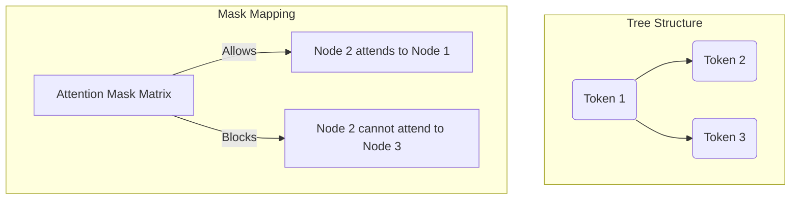

# Tree-Masked Parallel Verification

Tree-Masked Parallel Verification is a core system optimization that enables verifying non-linear, branching draft structures (draft trees) in a single target model forward pass.

## 💡 Core Concept
When a drafting engine generates a tree of multiple token hypotheses, verifying them one-by-one is inefficient. Tree-masked verification uses a block-diagonal attention mask to evaluate all paths in the tree simultaneously.

## ⚙️ How It Works
*   The tree nodes are flattened into a single sequence (sequence length $N$).
*   An attention mask is constructed where node $i$ can only attend to its ancestors in the tree.
*   This prevents information leakage across different branches, allowing the target model to calculate logits for all candidate paths in a single forward pass.

## 📊 Attention Mask Visualization

## 🔗 References
* [SpecInfer: Accelerating Generative LLM Serving with Speculative Decoding and Attentional Tree Sharing](https://arxiv.org/abs/2305.09781)
* [Medusa: Simple LLM Inference Acceleration Framework with Multiple Decoding Heads](https://arxiv.org/abs/2401.10774)
