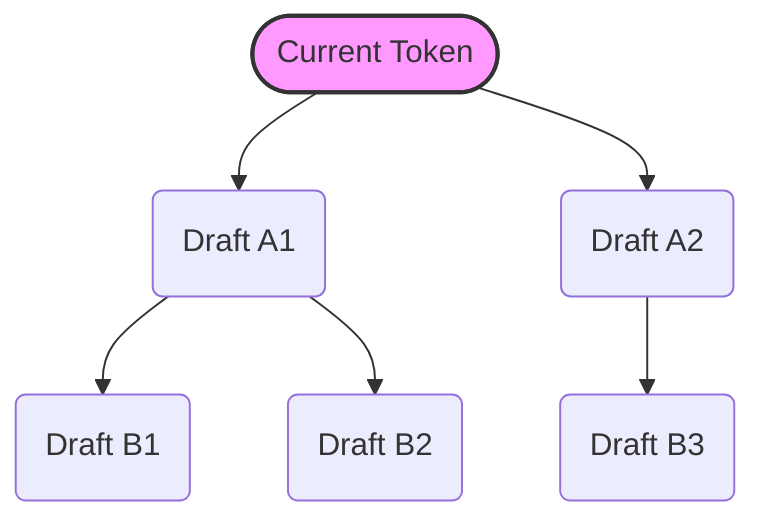

# The Tree-Structured & Feature-Drafting Era

The Tree-Structured and Feature-Drafting Era represents the modern state-of-the-art speculative decoding strategy, moving beyond simple linear text chains to branch structures and feature-level drafting.

## 💡 Core Concept
Systems like **EAGLE** and tree-based verification (e.g., SpecTr) abandoned rigid linear look-ahead. Instead of drafting text tokens, the drafting engine predicts hidden *feature vectors* at intermediate layers. Furthermore, they construct a branching **Tree of Thoughts** containing multiple possible draft paths.

## ⚙️ How It Works
1. **Feature Drafting:** The drafter predicts the features of the next tokens, which have lower uncertainty than discrete tokens.
2. **Tree Construction:** A tree of candidate token sequences is generated from the feature predictions to cover multiple paths.
3. **Tree-Masked Attention:** The target model evaluates all branches of the tree in a single forward pass using a custom sparse attention mask.

## 📊 Tree Speculation Diagram

## 🔗 References
* [EAGLE: Speculative Sampling Requires Rethinking Feature Uncertainty](https://arxiv.org/abs/2401.15077)
* [SpecTr: Fast Speculative Decoding via Optimal Transport](https://arxiv.org/abs/2310.15141)
